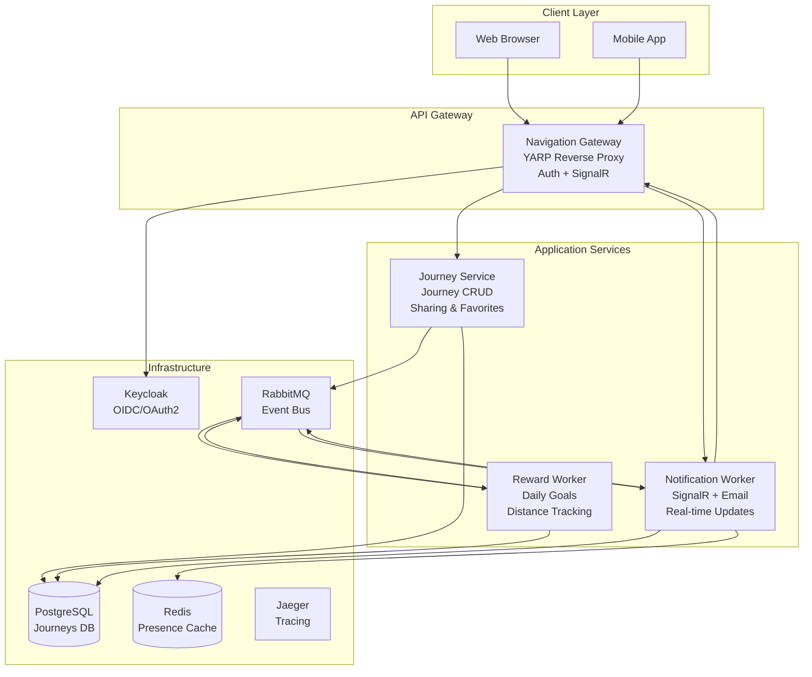
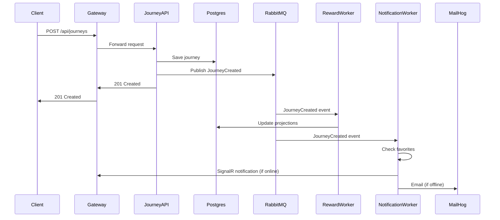
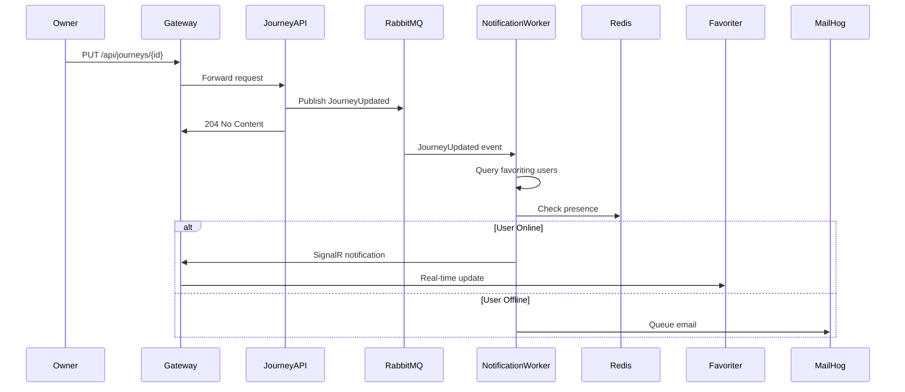

# Navigation Platform

A microservices-based navigation platform built with Clean Architecture, .NET 8, React 18, and TypeScript 5.

## Test Coverage


> **Note**: Coverage badges are generated by CI/CD pipelines. Minimum threshold is 80% for both backend and frontend.

## Quick Start

### One-Command Startup

```bash
docker compose up
```

This command will:
- Start all infrastructure services (PostgreSQL, Redis, RabbitMQ, Keycloak, Jaeger, MailHog)
- Build and start all application services (Gateway, Journey API, Reward Worker, Notification Worker)
- Build and start the frontend
- Initialize databases and import Keycloak realm configuration

The application will be available at:
- **Frontend**: http://localhost:5173
- **Gateway API**: http://localhost:5000
- **Keycloak Admin**: http://localhost:8080 (admin/admin)
- **Jaeger UI**: http://localhost:16686 (distributed tracing)
- **RabbitMQ Management**: http://localhost:15672 (guest/guest)
- **MailHog UI**: http://localhost:8025 (email testing - captures all emails sent by Notification Worker)

### Default Credentials

- **Demo User**: `demo` / `demo`
- **Admin User**: `admin` / `admin`

## Architecture

### System Overview

The Navigation Platform follows a **modular monolith** architecture pattern, organized as independently deployable services communicating via asynchronous events.



### Service Responsibilities

#### Navigation Gateway
- **Role**: API Gateway / BFF (Backend for Frontend)
- **Responsibilities**:
  - OAuth2/OIDC authentication with Keycloak (PKCE flow)
  - Reverse proxy to Journey Service
  - SignalR hubs for real-time notifications
  - User presence tracking (Redis)
  - Admin endpoints (user management)
  - Rate limiting and request correlation

#### Journey Service
- **Role**: Core domain service
- **Responsibilities**:
  - Journey CRUD operations
  - Journey sharing (public links, user-to-user)
  - Favorites management
  - Admin journey filtering and statistics
  - Monthly distance projections (CQRS)
  - Domain event publishing (Outbox pattern)

#### Reward Worker
- **Role**: Background processor
- **Responsibilities**:
  - Daily goal evaluation
  - Journey distance aggregation
  - Reward event publishing

#### Notification Worker
- **Role**: Background processor
- **Responsibilities**:
  - Real-time notifications via SignalR
  - Email fallback for offline users
  - Journey update/deletion notifications to favoriting users
  - User presence tracking

### Data Flow

#### Journey Creation Flow


#### Notification Flow (Journey Updated)


## Design Decisions & Tradeoffs

### Architecture Pattern: Modular Monolith
**Decision**: Use a modular monolith with independently deployable services rather than full microservices.

**Rationale**:
- **Pros**: Simpler deployment, easier local development, shared infrastructure, lower operational overhead
- **Cons**: Less isolation, potential for tight coupling (mitigated by Clean Architecture layers)
- **Tradeoff**: Chosen for development speed and operational simplicity while maintaining service boundaries

### Event-Driven Communication
**Decision**: Use RabbitMQ for asynchronous event communication between services.

**Rationale**:
- **Pros**: Loose coupling, scalability, resilience (services can process events at their own pace)
- **Cons**: Eventual consistency, complexity in debugging, need for idempotency
- **Tradeoff**: Accept eventual consistency for better scalability and resilience

### Outbox Pattern
**Decision**: Implement transactional outbox for reliable event publishing.

**Rationale**:
- **Pros**: Guarantees at-least-once delivery, prevents lost events, maintains ACID guarantees
- **Cons**: Additional database writes, background processing overhead
- **Tradeoff**: Accept slight performance overhead for reliability

### CQRS for Analytics
**Decision**: Use separate read models (projections) for monthly distance statistics.

**Rationale**:
- **Pros**: Optimized read performance, decoupled from write model, scalable queries
- **Cons**: Eventual consistency, additional storage, projection maintenance
- **Tradeoff**: Accept eventual consistency for query performance and scalability

### SignalR with Email Fallback
**Decision**: Use SignalR for real-time notifications with email fallback for offline users.

**Rationale**:
- **Pros**: Best user experience (real-time), guaranteed delivery (email), presence-aware
- **Cons**: Complexity in presence tracking, email delivery latency
- **Tradeoff**: Accept complexity for optimal UX

### Clean Architecture Layers
**Decision**: Organize code into Domain → Application → Infrastructure → Presentation layers.

**Rationale**:
- **Pros**: Testability, maintainability, technology independence, clear boundaries
- **Cons**: More files, indirection, learning curve
- **Tradeoff**: Accept initial complexity for long-term maintainability

### PostgreSQL for All Services
**Decision**: Use PostgreSQL for all service databases.

**Rationale**:
- **Pros**: ACID guarantees, relational queries, mature ecosystem, single database to manage
- **Cons**: Not optimized for all use cases (e.g., Redis for presence is better)
- **Tradeoff**: Simplicity and consistency over specialized databases (except Redis for presence)

## Production Scaling Strategy

### Horizontal Scaling

#### Stateless Services (Gateway, Journey API)
- **Strategy**: Deploy multiple instances behind a load balancer
- **Configuration**: 
  - Gateway: 2-4 instances (handles auth, proxying, SignalR)
  - Journey API: 3-5 instances (handles CRUD operations)
- **Load Balancing**: Round-robin with sticky sessions for SignalR connections
- **Health Checks**: Use `/healthz` and `/readyz` endpoints

#### Stateful Services (Workers)
- **Strategy**: Scale based on queue depth
- **Configuration**:
  - Reward Worker: 2-3 instances (processes journey events)
  - Notification Worker: 2-4 instances (processes notification events)
- **Scaling Trigger**: RabbitMQ queue depth > 1000 messages
- **Consideration**: Ensure idempotency in all handlers

### Database Scaling

#### PostgreSQL
- **Read Replicas**: 2-3 read replicas for analytics queries (monthly statistics)
- **Connection Pooling**: PgBouncer or built-in connection pooling
- **Partitioning**: Partition `journeys` table by `start_time` (monthly partitions)
- **Indexing**: 
  - Composite indexes on frequently queried columns (userId, startTime, transportType)
  - GIN indexes for full-text search (if needed)

#### Redis
- **Strategy**: Redis Cluster for high availability
- **Configuration**: 3 master + 3 replica nodes
- **Use Cases**: User presence, session cache, rate limiting

### Message Queue Scaling

#### RabbitMQ
- **Strategy**: RabbitMQ Cluster (3 nodes)
- **Configuration**: 
  - Mirrored queues for high availability
  - Queue TTL for old messages
  - Dead letter queues for failed messages
- **Monitoring**: Alert on queue depth > 100 messages for 5 minutes

### Caching Strategy

- **Application Cache**: Redis for user presence, session data
- **CDN**: CloudFront/Cloudflare for frontend static assets
- **API Response Cache**: Cache public journey data (with invalidation on updates)

### Monitoring & Observability

- **Metrics**: Prometheus scraping `/metrics` endpoints
- **Tracing**: Jaeger for distributed tracing (OpenTelemetry)
- **Logging**: Structured JSON logs (Serilog) with correlation IDs
- **Alerting**: Prometheus alert rules (queue lag, error rates, latency)

### Deployment Strategy

- **Container Orchestration**: Kubernetes or Docker Swarm
- **CI/CD**: GitHub Actions → Build images → Push to registry → Deploy to cluster
- **Blue-Green Deployment**: Zero-downtime deployments with health checks
- **Database Migrations**: Run migrations as init containers before service startup

### Security Scaling

- **Keycloak**: Keycloak cluster (3+ nodes) with shared database
- **Rate Limiting**: Distributed rate limiting using Redis
- **API Keys**: Rotate keys regularly, use secrets management (HashiCorp Vault, AWS Secrets Manager)

### Cost Optimization

- **Auto-scaling**: Scale down during off-peak hours
- **Reserved Instances**: Use reserved instances for predictable workloads
- **Spot Instances**: Use spot instances for workers (with graceful shutdown)

## Technology Stack

### Backend
- **.NET 8**: Core framework
- **Entity Framework Core 8**: ORM
- **MediatR**: In-process messaging (CQRS)
- **RabbitMQ**: Asynchronous messaging
- **PostgreSQL 16**: Primary database
- **Redis 7**: Caching and presence
- **Keycloak 25**: Identity and access management
- **Serilog**: Structured logging
- **OpenTelemetry**: Distributed tracing
- **Prometheus**: Metrics collection

### Frontend
- **React 18**: UI framework
- **TypeScript 5**: Type safety
- **Vite**: Build tool
- **SignalR**: Real-time communication
- **React Router 7**: Routing
- **Axios**: HTTP client
- **Vitest**: Testing framework

### Infrastructure
- **Docker**: Containerization
- **Docker Compose**: Local orchestration
- **NGINX**: Reverse proxy (frontend)
- **Jaeger**: Distributed tracing
- **MailHog**: Email testing

## Development

### Prerequisites
- .NET 8 SDK
- Node.js 20+
- Docker Desktop
- Git

### Local Development

1. **Clone the repository**
   ```bash
   git clone <repository-url>
   cd Navigation_Platform
   ```

2. **Start infrastructure**
   ```bash
   docker compose up -d postgres redis rabbitmq keycloak jaeger mailhog
   ```

3. **Run migrations**
   ```bash
   # Migrations run automatically on service startup
   ```

4. **Start backend services**
   ```bash
   # Gateway
   cd src/gateway/NavigationPlatform.Gateway
   dotnet run

   # Journey API
   cd src/journeys/NavigationPlatform.Journeys.Api
   dotnet run

   # Workers (separate terminals)
   cd NavigationPlatform.RewardWorker
   dotnet run

   cd NavigationPlatform.NotificationWorker
   dotnet run
   ```

5. **Start frontend**
   ```bash
   cd frontend
   npm install
   npm run dev
   ```

### Testing

#### Backend Tests
```bash
dotnet test Navigation_Platform.sln --collect:"XPlat Code Coverage"
```

#### Frontend Tests
```bash
cd frontend
npm test
npm run test:coverage
```

### Code Quality

#### Backend
- **Linting**: Roslyn analyzers (built-in)
- **Style**: StyleCop
- **Coverage**: Minimum 80% (enforced in CI)

#### Frontend
- **Linting**: ESLint
- **Formatting**: Prettier
- **Security**: OWASP Dependency Check
- **Coverage**: Minimum 80% (enforced in CI)

## API Documentation

See [Navigation_Platform.postman_collection.json](Navigation_Platform.postman_collection.json) for a complete Postman collection, or [src/journeys/NavigationPlatform.Journeys.Api/NavigationPlatform.Api.http](src/journeys/NavigationPlatform.Journeys.Api/NavigationPlatform.Api.http) for HTTP files.

## License

[Add your license here]
